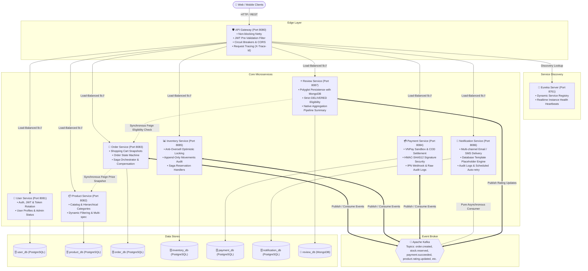

# 🛍️ MiniShop — E-Commerce Microservices Platform

[](https://adoptium.net/)
[](https://spring.io/projects/spring-boot)
[](https://spring.io/projects/spring-cloud)
[](https://kafka.apache.org/)
[](https://www.postgresql.org/)
[](https://www.mongodb.com/)
[](https://www.docker.com/)

**MiniShop** is an enterprise-grade, distributed e-commerce backend platform built with **Java 25**, **Spring Boot 4.1**, **Spring Cloud 2025**, and **Apache Kafka**. Designed to mirror high-throughput production e-commerce architectures (e.g., Shopee, Lazada), it implements core distributed patterns including **Choreography-based Saga**, **Anti-Oversell Optimistic Locking Concurrency Control**, **Polyglot Persistence (PostgreSQL & MongoDB)**, **Payment Gateway HMAC-SHA512 Verification**, **Asynchronous Notifications**, **Stateless JWT Security**, **Service Discovery**, **Resilience4j Circuit Breakers**, and **Database-per-Service** isolation.

---

## 🏛️ System Architecture



---

## 📦 Microservices Catalog

| Service | Port | Database | Primary Responsibilities | Status |
|---|---|---|---|---|
| **[Eureka Server](./eureka-server)** | `8761` | *None* | Centralized Service Registry, Dynamic Discovery, Health Checks | ✅ Active |
| **[API Gateway](./api-gateway)** | `8080` | *None* | Reactive Entrypoint, Route Management, JWT Filter, Circuit Breakers, CORS | ✅ Active |
| **[User Service](./user-service)** | `8081` | `user_db` (PostgreSQL) | Authentication, Token Rotation, Role-based Auth (`ADMIN`, `SELLER`, `CUSTOMER`) | ✅ Active |
| **[Product Service](./product-service)** | `8082` | `product_db` (PostgreSQL) | Product Catalog, Category Tree, Specification Search, Owner Authorization | ✅ Active |
| **[Order Service](./order-service)** | `8083` | `order_db` (PostgreSQL) | Shopping Cart, Order State Machine, OpenFeign, Kafka Saga Orchestration | ✅ Active |
| **[Inventory Service](./inventory-service)** | `8085` | `inventory_db` (PostgreSQL) | Anti-Oversell Optimistic Locking (`@Version`), Saga Event Handlers, Append-only Audit | ✅ Active |
| **[Payment Service](./payment-service)** | `8084` | `payment_db` (PostgreSQL) | VNPay Sandbox Gateway, HMAC-SHA512 Signature Security, IPN Server Webhook, Raw Audit Logs | ✅ Active |
| **[Notification Service](./notification-service)** | `8086` | `notification_db` (PostgreSQL) | Multi-channel Delivery (Email/SMS), Template Placeholder Engine, Audit Logs, Auto-Retry | ✅ Active |
| **[Review Service](./review-service)** | `8087` | `review_db` (MongoDB) | Polyglot Persistence, Order Item Eligibility, Mongo Aggregation Pipeline, Rating Sync | ✅ Active |

---

## ⚡ Choreography-based Saga Orchestration

The platform implements a distributed **Choreography-based Saga pattern** to maintain data consistency across services without two-phase commit (2PC) locks.

```text
1. Order Creation:
   [Client] POST /api/v1/orders/checkout ──► [Order Service]
                                                  │
                                                  ├─► Saves Order (PENDING) & captures immutable snapshots
                                                  ├─► Clears Shopping Cart
                                                  └─► Publishes "order.created" to Kafka

2. Stock Reservation (Inventory Service - Optimistic Locking):
   [Kafka] "order.created" ──► [Inventory Service]
                                      │
                                      ├── (Success: all items available) ──► Publishes "stock.reserved"
                                      └── (Failure: out of stock)        ──► Publishes "stock.rejected"

3. Order State Advance / Payment Trigger:
   [Kafka] "stock.reserved" ──► [Order Service]
                                      │
                                      ├─► Status: STOCK_RESERVED
                                      └─► Publishes "payment.requested"

4. Payment Processing (Payment Service):
   [Kafka] "payment.requested" ──► [Payment Service]
                                         │
                                         ├── (COD) ────► Status: SUCCESS ──► Publishes "payment.succeeded"
                                         ├── (VNPAY) ──► Generates Sandbox Checkout URL (Status: PENDING)
                                         │                 │
                                         │                 ▼
                                         │               [VNPay Server IPN Callback]
                                         │                 ├── (00 Success) ──► Publishes "payment.succeeded"
                                         │                 └── (Failed)     ──► Publishes "payment.failed"

5. Order Confirmation & Compensating Transactions:
   [Kafka] "payment.succeeded" ──► [Order Service] ──────► Status: CONFIRMED ──► Publishes "order.confirmed"
                                   [Inventory Service] ──► Deducts real stock & publishes "inventory.updated"
                                   [Notification Service] ─► Renders ORDER_CONFIRMED & Dispatches Email

   [Kafka] "payment.failed"    ──► [Order Service] ──────► Status: CANCELLED ──► Publishes "order.cancelled"
                                   [Inventory Service] ──► Releases reserved stock & publishes "inventory.updated"
                                   [Notification Service] ─► Renders ORDER_CANCELLED / PAYMENT_FAILED & Dispatches Email

6. Customer Reviews & Rating Sync (Post-Delivery):
   [Client] POST /api/v1/reviews ──► [Review Service]
                                            │
                                            ├─► Feign check with Order Service: order.status == DELIVERED
                                            ├─► Saves Document in MongoDB
                                            ├─► Calculates Aggregation Pipeline (Avg & Breakdown)
                                            └─► Publishes "product.rating.updated" ──► Consumed by Product Service
```

---

## 🛡️ Key Architectural Patterns & Features

- **Polyglot Persistence**: Strategic database selection based on data characteristics (PostgreSQL for strict ACID transactions in Orders/Inventory/Payments, and MongoDB for read-heavy flexible review documents).
- **Strict Business Rule Enforcement**: Reviews strictly require `DELIVERED` order status and user ownership verified via synchronous OpenFeign calls.
- **Native Database Aggregations**: Rating distributions (1-5 stars) and averages are computed natively in MongoDB using `$match` and `$group` aggregation pipelines.
- **Database per Service**: Zero direct table joins across services. Cross-service data is communicated via synchronous OpenFeign DTOs or asynchronous Kafka domain events.
- **Asynchronous Side-Effect Isolation**: Notification delivery failures never throw unhandled exceptions back to Kafka or block core checkout/payment workflows.
- **Database-Driven Notification Templates**: Templates are stored in `notification_templates` for zero-downtime content edits, supporting dynamic `{{placeholder}}` token rendering.
- **Cryptographic Gateway Security**: VNPay callbacks are strictly validated with HMAC-SHA512. Return URLs are strictly decoupled from authoritative server-to-server IPN webhooks.
- **Raw Callback & Notification Audit Trails**: Verbatim payloads from gateways are saved in `payment_callback_logs` and all delivered notifications are tracked in `notification_logs`.
- **Optimistic Locking Anti-Oversell Control**: JPA `@Version` on `Inventory` combined with Spring Retry (`@Retryable`) ensures multiple concurrent purchases on scarce items never result in overselling.
- **Append-Only Movement Audit Trail**: Every stock change (`IMPORT`, `RESERVE`, `DEDUCT`, `RELEASE`, `ADJUST`) is permanently logged into `stock_movements` for audit and reconciliation.
- **Immutable Price & Name Snapshots**: When adding items to cart or checking out, `order-service` captures snapshots of product name and price. Future seller updates never alter historical orders.
- **Idempotent Consumers**: Consumers verify message uniqueness against `processed_events` before executing business logic, protecting against duplicate deliveries.
- **Stateless Authentication**: JJWT 0.12.6 tokens with SHA-256 hashed refresh tokens, token rotation on refresh, and instant revocation on logout.
- **Reactive API Gateway**: Non-blocking Spring Cloud Gateway filtering requests, attaching `X-Trace-Id` headers, extracting user claims (`X-User-Id`, `X-User-Role`), and providing Resilience4j 503 fallback handlers.

---

## 📡 API Catalog Overview

### 👤 User Service (`8081` / via Gateway `8080`)
```http
POST   /api/v1/auth/register          # Register user (CUSTOMER / SELLER)
POST   /api/v1/auth/login             # Authenticate & issue Access + Refresh tokens
POST   /api/v1/auth/refresh           # Rotate refresh token & get new access token
POST   /api/v1/auth/logout            # Revoke refresh token
GET    /api/v1/users/me               # Get current user profile (JWT)
PUT    /api/v1/users/me               # Update current profile (JWT)
GET    /api/v1/users                  # Admin: List users with pagination & filtering
PUT    /api/v1/users/{id}/status      # Admin: Lock/Activate user account
```

### 📦 Product Service (`8082` / via Gateway `8080`)
```http
GET    /api/v1/products               # Public: Dynamic multi-criteria search & pagination
GET    /api/v1/products/{id}          # Public: Product detail with image gallery
POST   /api/v1/products               # Seller/Admin: Create new product
PUT    /api/v1/products/{id}          # Owner/Admin: Update product details
DELETE /api/v1/products/{id}          # Owner/Admin: Soft delete product (HIDDEN)
GET    /api/v1/categories             # Public: Category tree hierarchy
POST   /api/v1/categories             # Admin: Create category
```

### 🛒 Order Service (`8083` / via Gateway `8080`)
```http
GET    /api/v1/cart                   # Get current user's shopping cart & subtotal
POST   /api/v1/cart/items             # Add product with real-time price snapshot
PUT    /api/v1/cart/items/{itemId}    # Update item quantity
DELETE /api/v1/cart/items/{itemId}    # Remove item from cart
DELETE /api/v1/cart                   # Clear cart
POST   /api/v1/orders/checkout        # Checkout cart & launch Saga workflow
GET    /api/v1/orders                 # User: Order history with status filter
GET    /api/v1/orders/{id}            # User/Admin: Order detail & audit status history
POST   /api/v1/orders/{id}/cancel     # User: Cancel order (triggers compensation)
PUT    /api/v1/orders/{id}/status     # Seller/Admin: Advance order lifecycle
```

### 📊 Inventory Service (`8085` / via Gateway `8080`)
```http
POST   /api/v1/inventory/import          # Admin/Seller: Import stock with batch note
GET    /api/v1/inventory/{productId}     # Admin/Seller: View inventory & version numbers
PUT    /api/v1/inventory/{productId}/adjust # Admin: Manually adjust stock with audit note
GET    /api/v1/inventory/{productId}/movements # Admin: View append-only audit trail
```

### 💳 Payment Service (`8084` / via Gateway `8080`)
```http
GET    /api/v1/payments/{orderId}/status       # Poll payment transaction status & URL
GET    /api/v1/payments/{orderId}/callback-logs # Admin: View raw gateway callback audit logs
GET    /api/v1/payments/vnpay/return          # Public: Non-authoritative return display
GET    /api/v1/payments/vnpay/ipn             # Public: Authoritative Server-to-Server IPN webhook
POST   /api/v1/payments/vnpay/ipn             # Public: Authoritative Server-to-Server IPN webhook
```

### 🔔 Notification Service (`8086` / via Gateway `8080`)
```http
GET    /api/v1/notifications/logs             # Admin: Query notification delivery logs with filters
POST   /api/v1/notifications/{logId}/resend   # Admin: Manually trigger redelivery of failed notification
GET    /api/v1/notifications/templates        # Admin: List all notification templates & tokens
```

### ⭐ Review Service (`8087` / via Gateway `8080`)
```http
POST   /api/v1/reviews                        # Customer: Submit a review for delivered order item
GET    /api/v1/reviews/product/{productId}    # Public: List paginated reviews with star filter
GET    /api/v1/reviews/product/{productId}/summary # Public: Get rating summary & star breakdown
POST   /api/v1/reviews/{id}/reply             # Seller/Admin: Reply to customer review
PUT    /api/v1/reviews/{id}/hide              # Admin: Soft-hide abusive review
```

---

## 🎨 Frontend Portal (Google Stitch Design Spec)

MiniShop includes a high-fidelity frontend UI comprising **25 interconnected screens** designed directly via Google Stitch (`projects/573268449518407870`), built with Tailwind CSS, Material Symbols, Inter typography, and centralized API Client (`frontend/js/api.js`):

- **🛒 Customer Storefront (13 Screens)**: [index.html](./frontend/index.html), [login.html](./frontend/login.html), [register.html](./frontend/register.html), [forgot-password.html](./frontend/forgot-password.html), [change-password.html](./frontend/change-password.html), [account.html](./frontend/account.html), [product-listing.html](./frontend/product-listing.html), [product-detail.html](./frontend/product-detail.html), [cart.html](./frontend/cart.html), [checkout.html](./frontend/checkout.html), [payment-result.html](./frontend/payment-result.html), [my-orders.html](./frontend/my-orders.html), [order-details.html](./frontend/order-details.html), [product-review.html](./frontend/product-review.html)
- **🏪 Seller Center (4 Screens)**: [my-products.html](./frontend/my-products.html), [seller-product-edit.html](./frontend/seller-product-edit.html), [inventory-management.html](./frontend/inventory-management.html), [orders-to-process.html](./frontend/orders-to-process.html)
- **🛡️ Admin Console (6 Screens)**: [admin-users.html](./frontend/admin-users.html), [category-management.html](./frontend/category-management.html), [global-order-monitoring.html](./frontend/global-order-monitoring.html), [admin-inventory.html](./frontend/admin-inventory.html), [admin-payment-logs.html](./frontend/admin-payment-logs.html), [notification-logs.html](./frontend/notification-logs.html)
- **💻 Developer & Debug Console (2 Screens)**: [debug-api-console.html](./frontend/debug-api-console.html), [debug-system-status.html](./frontend/debug-system-status.html)

---

## 🛠️ Technology Stack & Dependencies

- **Language & JDK**: Java 25 LTS (Eclipse Temurin)
- **Frameworks**: Spring Boot 4.1.0, Spring Cloud 2025.1.3 (Gateway, Netflix Eureka, OpenFeign)
- **Frontend**: Google Stitch UI Spec, Tailwind CSS, Vanilla JS API Client & Global Navigation Switcher
- **Event Messaging**: Apache Kafka 3.x with Spring Kafka
- **Persistence**: PostgreSQL 16, MongoDB 7, Spring Data JPA, Spring Data MongoDB, Flyway
- **Mailing & Communication**: Spring Boot Mail (`JavaMailSender`), Jakarta Mail, Mailpit Sandbox
- **Cryptography & Security**: HMAC-SHA512 Signature Verification, Spring Security 6, JJWT 0.12.6, BCrypt
- **Concurrency & Resilience**: JPA `@Version` Optimistic Locking, Spring Retry (`@Retryable`), Resilience4j Circuit Breaker
- **Mapping & Utilities**: MapStruct 1.5.5, Lombok
- **API Documentation**: Springdoc OpenAPI (Swagger UI at `/swagger-ui.html`)
- **Containerization**: Multi-stage Dockerfiles with healthchecks

---

## 🚀 Getting Started

### 1. Prerequisites
- **JDK 25 LTS**
- **Docker & Docker Compose** (for PostgreSQL, MongoDB, Kafka, Zookeeper, Mailpit)
- **Maven 3.9+** (or using bundled `./mvnw`)

### 2. Launching Infrastructure & Microservices

```powershell
# 1. Start Infrastructure Containers (Postgres, Mongo, Kafka, Mailpit)
.\start-infra.bat

# 2. Start All Microservices in Sequence (PowerShell)
.\start-services.ps1

# 3. Stop All Running Microservices cleanly
.\stop-services.ps1
```

### 3. Service Dashboards & Swagger UIs
- **Frontend Portal**: [frontend/index.html](./frontend/index.html)
- **Eureka Dashboard**: [http://localhost:8761](http://localhost:8761)
- **API Gateway Entry**: [http://localhost:8080](http://localhost:8080)
- **Mailpit Web UI (Sandbox Emails)**: [http://localhost:8025](http://localhost:8025)
- **User Service Swagger**: [http://localhost:8081/swagger-ui.html](http://localhost:8081/swagger-ui.html)
- **Product Service Swagger**: [http://localhost:8082/swagger-ui.html](http://localhost:8082/swagger-ui.html)
- **Order Service Swagger**: [http://localhost:8083/swagger-ui.html](http://localhost:8083/swagger-ui.html)
- **Inventory Service Swagger**: [http://localhost:8085/swagger-ui.html](http://localhost:8085/swagger-ui.html)
- **Payment Service Swagger**: [http://localhost:8084/swagger-ui.html](http://localhost:8084/swagger-ui.html)
- **Notification Service Swagger**: [http://localhost:8086/swagger-ui.html](http://localhost:8086/swagger-ui.html)
- **Review Service Swagger**: [http://localhost:8087/swagger-ui.html](http://localhost:8087/swagger-ui.html)

---

## 📄 License
This project is open-source and available under the [MIT License](LICENSE).
